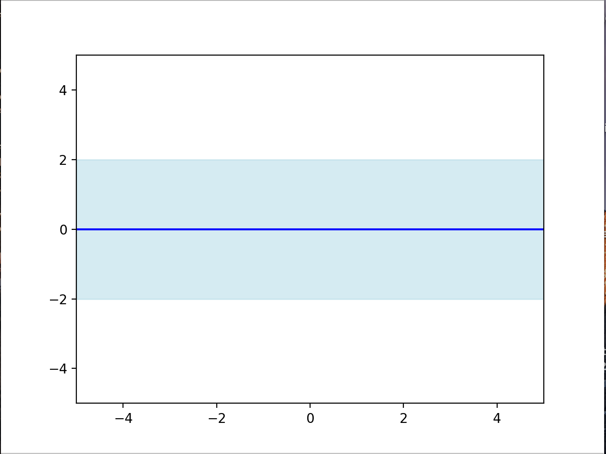
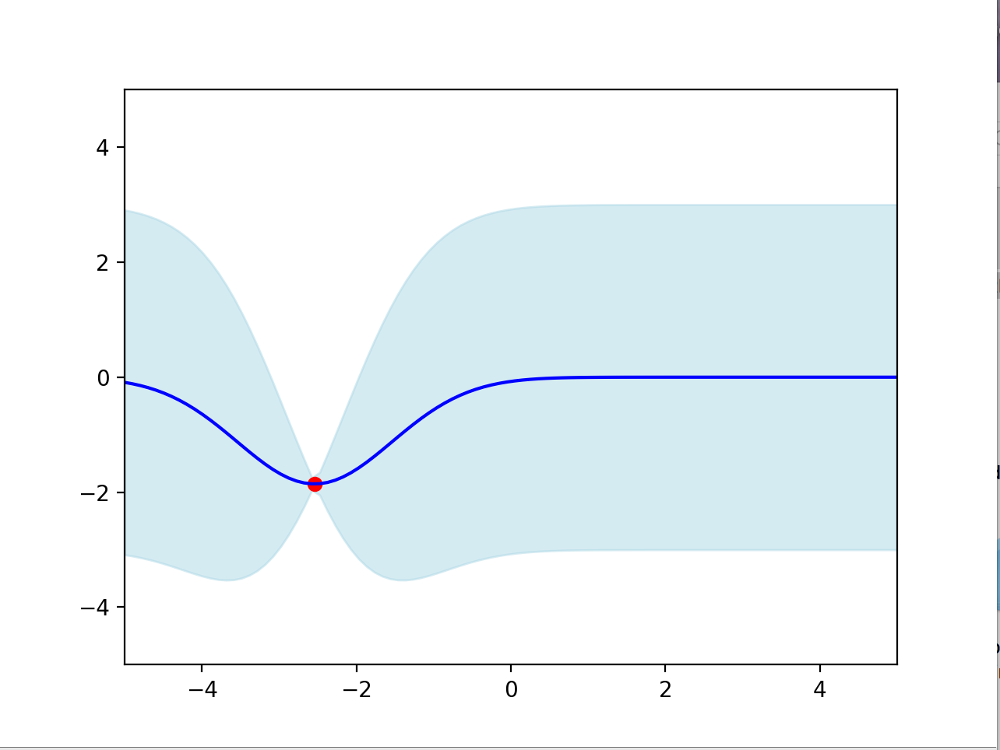
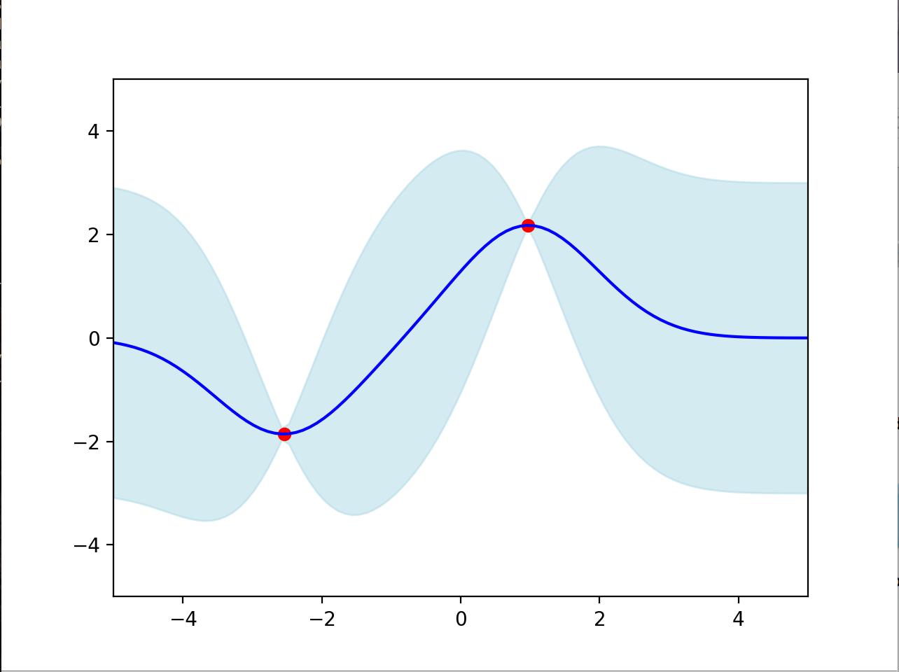
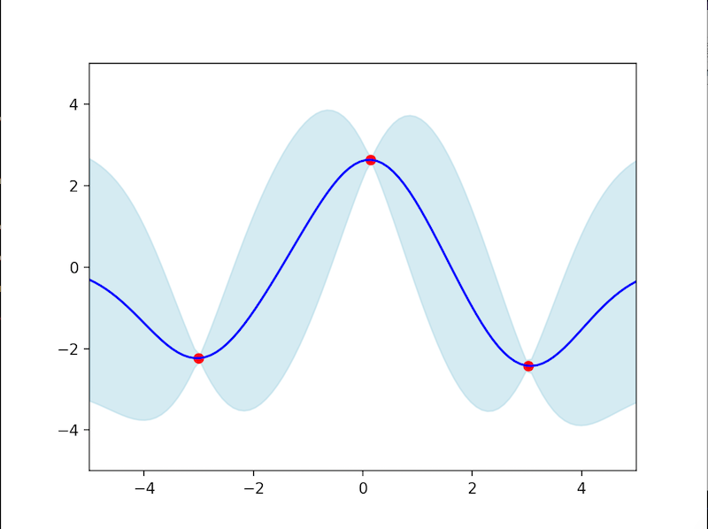
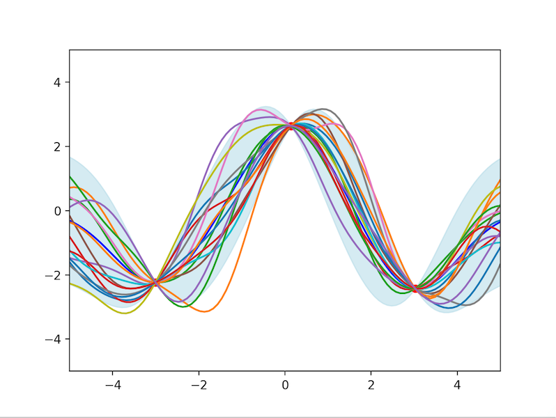

## Gaussian Process demo
Simple and very basic interactive demo from Gaussian Process (GP) in python from scratch. It was meant to be 
useful for showing students how GP works right after showing the math behing GP regression.

From command line it can be run by
`python GP_demo.py --lengthscale 1 --output_var 1 --noise_var 0.00005 --n_samples 15`
where you can define the lengthscale and magnitude of the kernel, the noise and the number of samples
from the posterior distribution. 

#### How it works

1 - When you run the program, you get the prior distribution

2- With a single click on the open window yo uwill add a point and then we refit the GP
showing the posterior distribution.

3- You can do it for other steps

4- With a double click you can sample from the posterior

####TODO: 
If one adds a lot of points then the hyperparameters of the GP are not optimize. Adding the optimization step make would make the
interactive plot a bit slower, so I am still thinking about adding it. 